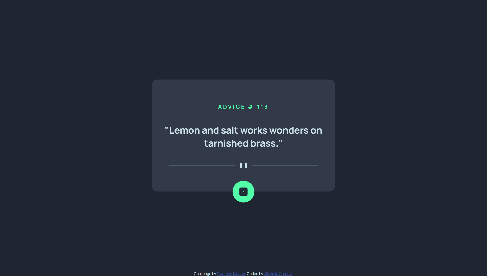

# Frontend Mentor - Advice generator app solution

This is a solution to the [Advice generator app challenge on Frontend Mentor](https://www.frontendmentor.io/challenges/advice-generator-app-QdUG-13db). Frontend Mentor challenges help you improve your coding skills by building realistic projects.

## Table of contents

- [Overview](#overview)
  - [The challenge](#the-challenge)
  - [Screenshot](#screenshot)
  - [Links](#links)
- [My process](#my-process)
  - [Built with](#built-with)
  - [What I learned](#what-i-learned)
  - [Continued development](#continued-development)
- [Author](#author)


## Overview

### The challenge

Users should be able to:

- View the optimal layout for the app depending on their device's screen size
- See hover states for all interactive elements on the page
- Generate a new piece of advice by clicking the dice icon

### Screenshot



### Links

- Solution URL: [](https://github.com/michellecordovi/APIAdviceGenerator)
- Live Site URL: [](https://michellecordovi.github.io/APIAdviceGenerator/)

## My process

### Built with

- semantic HTML5
- CSS3
- CSS flexbox
- Vanilla JavaScript
- Ajax


### What I learned

This was my first full project utilizing API requests!

```js
const getAdvice = async () => {
      const endpoint = 'https://api.adviceslip.com/advice';
      try {
            const response = await fetch(endpoint);
            if (response.ok) {
                  const JSresponse = await response.json()
                  randomAdvice.innerHTML = '"' + JSresponse.slip.advice + '"';
                  adviceNum.innerHTML = JSresponse.slip.id;
                  
                  setTimeout(() => {
                        diceButton.style.transition = "box-shadow 0.5s, transform 0s";
                        diceButton.style.boxShadow = "none";
                        diceButton.style.transform = "none";
                  }, 1000)
            }
      } catch (error) {
             console.log(error)
      }
}

```

### Continued development

I definitely want to continue to grow my skills for the use API requests.


## Author

- Website - [Michelle Cordovi LinkedIn](https://www.linkedin.com/in/michelle-cordovi-dpt-35588683/)
- Frontend Mentor - [@michellecordovi](https://www.frontendmentor.io/profile/michellecordovi)
